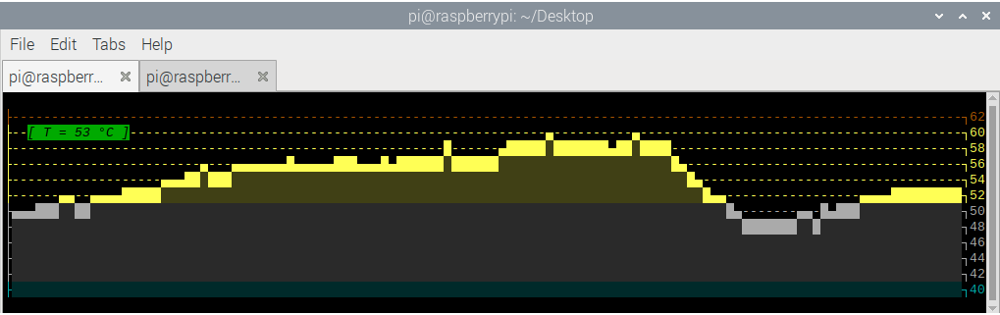

#	b2temp 

## Description

**b2temp** is a simple bash script that displays the current CPU temperature
alongside a chart of said temperature over time. It tends to make quite 
a nice combo with tmux and htop. With some modifications it can be used 
to display other values such as internet download/upload speed, cpu or
gpu usage or anything else that that would result in an interesting chart.

